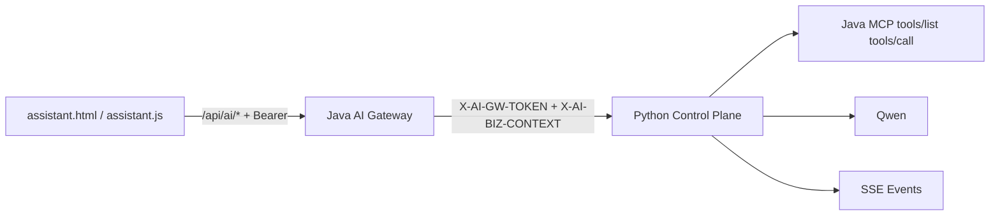

本篇记录本次 AI Chat 网关化重构的落地结果，重点是把请求入口、认证与业务上下文注入统一收口到 Java 网关，再由 Python 控制平面执行编排。

## 改造摘要

1. Java 成为 AI Gateway 统一入口：
- 前端不再直连 Python，而是走 `/api/ai/*`。
- Java 在转发到 Python 前注入两类内部头：
  - `X-AI-GW-TOKEN`
  - `X-AI-BIZ-CONTEXT`（签名业务上下文，包含 `userId/tenantDeptId/traceId/iat/exp` 等）

2. Python 新增并强制执行网关鉴权中间件：
- 所有 `/ai/*` 业务接口默认需要 `X-AI-GW-TOKEN + X-AI-BIZ-CONTEXT`。
- 通过 HMAC 校验上下文签名，并校验时间窗口（`iat/exp` + `AI_GATEWAY_CLOCK_SKEW_SECONDS`）。
- 鉴权通过后将上下文写入 `request.state.auth_context`，用于 run owner 与工具上下文注入。

3. 前端调用路径统一为 Java 网关：
- `assistant.js` 默认 `aiApiPrefix` 为 `/api/ai`。
- 前端不再管理 `x-user-id/x-tenant-dept-id` 直传头，用户上下文由 Java 登录态和网关注入机制统一处理。

## 端到端链路（当前状态）



状态结论：
- 主链路已打通：前端 -> Java 网关 -> Python -> MCP/LLM -> SSE 回流。
- Python 侧已从“可选透传头”切到“默认强制网关签名头”。

## 联调排障发现（重点）

1. 无签名头直连 Python 会被拒绝  
现象：`401`，提示缺少 `X-AI-GW-TOKEN` 和 `X-AI-BIZ-CONTEXT`。  
结论：符合预期，防止前端或外部直接绕过网关调用。

2. 签名或 token 不一致会 401  
现象：`invalid gateway internal token` 或 `invalid gateway context signature`。  
结论：Java/Python 需严格对齐 `AI_GATEWAY_INTERNAL_TOKEN` 与签名密钥。

3. Biz Context 时间窗口导致偶发失败  
现象：`gateway context expired` 或 `gateway context iat is in the future`。  
结论：网关与 Python 服务器时间需同步（NTP），并合理设置 `AI_GATEWAY_CLOCK_SKEW_SECONDS`。

4. 前端历史环境仍可能误指向 `/ai`  
现象：浏览器控制台出现 401/跨域或无登录态问题。  
结论：前端配置必须统一到 `/api/ai`，由 Java 承担认证与上下文注入。

## 验证命令（可复现）

### 1) Python 单测

```bash
cd ~/Desktop/Work/ats_iot_ai
pytest -q tests/test_runs.py tests/test_sqlite_store.py tests/test_assistant_page.py
```

### 2) 网关链路验证（通过 Java）

```bash
curl -sS -X POST 'http://127.0.0.1:10001/api/ai/runs' \
  -H 'Content-Type: application/json' \
  -H 'Authorization: Bearer <java-login-token>' \
  -H 'Idempotency-Key: gw-run-001' \
  -d '{"query":"hello"}'
```

```bash
curl -N 'http://127.0.0.1:10001/api/ai/runs/<run_id>/events' \
  -H 'Authorization: Bearer <java-login-token>'
```

### 3) 负向校验（直连 Python，预期 401）

```bash
curl -sS -X POST 'http://127.0.0.1:8000/ai/runs' \
  -H 'Content-Type: application/json' \
  -d '{"query":"should fail without gateway headers"}'
```

## 已知 caveats

- `AI_ALLOW_LEGACY_AUTH` 仅建议迁移期临时开启，长期应关闭，避免回退到明文 legacy 头。
- 若 Java 代理层未透传 `Last-Event-ID`，SSE 断线续传能力会受限。
- 网关签名上下文需统一编码与签名算法（当前为 `v1.<payload_b64url>.<sig_b64url>` 约定），任一端改动都必须同步联调。
- 调试时优先查看 Python 返回的 401 明细文案，可快速判断是 token、签名、格式还是时钟问题。

## 结论

这次重构把 AI Chat 的“入口、鉴权、上下文注入”彻底收口到 Java 网关，Python 专注编排与执行，前端专注交互。架构边界更清晰，线上排障路径也更短。
