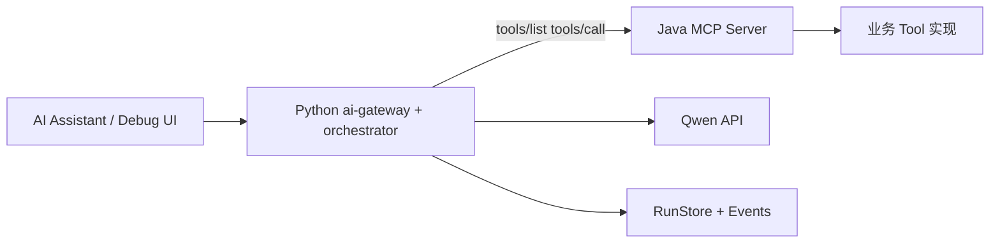

## 目标与边界

本轮重构的目标是把 AI 聊天从“Java 单体链路”收敛为“Python 控制平面 + Java MCP 执行平面”，并解决线上已暴露的问题：

- 普通聊天误入 ReAct
- MCP 工具失败导致 run 直接失败
- Qwen 超时后返回 `echo`
- 联调时 Python/Java token 不一致导致 MCP 401

边界上，Java 只保留 MCP + Tool 能力；会话编排、SSE、策略、前端调试全部归到 Python。

## 最终架构

## 本次整体改动（按模块）

### 1) Java 侧：AI 模块收口为 MCP-only

- 移除非 MCP 的旧 AI 运行链路、历史配置和无关依赖，降低维护面。
- 工具注册与元数据从 LangChain4j 解耦，保留必要实体与执行能力。
- 新增/增强 MCP 入口能力：`tools/list`、`tools/call`、上下文解析与注入快照。
- 完成 MCP 端单测替换：从旧测试迁移到 MCP 端点覆盖。
- 增加本地/开发调试必需能力（如 dev/local 启动兼容、调试登录入口）。

### 2) Python 侧：编排能力生产化

- 意图路由改为 LLM-first，统一 `IntentRouter -> Policy -> Strategy`。
- 策略明确化：
  - `CHAT -> DIRECT`
  - `TOOL_CALL/ANALYZE/TRACE -> REACT`
- ReAct 失败时不再硬失败，触发 `tool_fallback` 后降级 DIRECT，保证会话可恢复。
- 运行时绑定与上下文快照注入，增强跨事件可追踪性。

### 3) MCP 联调治理

- Python MCP token 来源简化为 `MCP_API_TOKEN`，本地默认 `AAA`。
- 与 Java MCP internal token 对齐，修复 401 鉴权不一致问题。
- 启动日志和调试页展示 Java MCP 连接状态，联调可视化更直接。

### 4) Qwen 稳定性治理

- 去掉异常时 `echo: 用户问题` 的回退行为。
- 超时与重试参数化：
  - `QWEN_TIMEOUT_SECONDS=60`
  - `QWEN_MAX_RETRIES=2`
- 失败时统一用户可读文案：`当前模型服务暂不可用，请稍后重试。`

### 5) 前端与开发体验

- 调试页升级为左右分栏：
  - 左侧紧凑时间轴卡片（摘要）
  - 右侧原始 SSE 事件（明细）
- 新增独立用户态页面 `assistant.html`，与开发调试页分离。
- 启动脚本简化并默认跟踪日志，减少“启动了但看不到日志”的调试成本。

## 关键问题与修复闭环

1. `query=你是谁` 误走 ReAct并返回 echo  
修复：LLM 意图统一路由 + DirectStrategy 取消 echo fallback。

2. MCP 401 (`mcp_unauthorized`)  
修复：Python/Java token 统一策略，默认 `AAA`，链路可观测。

3. 模型超时导致体验不可控  
修复：Qwen 超时提升到 60s + 重试 + 明确降级文案。

## 结果验收

- Python 侧自动化测试通过（本轮关键节点执行过 `pytest -q`，通过）。
- 聊天与工具调用链路从“硬失败”转为“可恢复”。
- Java 侧职责收敛，后续可以围绕 Tool 能力继续扩展，而不再背负编排复杂度。

## 仍待收尾

- 部分业务工具在特定上下文下仍可能返回 Java 500（例如个别炉次查询场景）。
- 下一步重点是工具级根因治理与端到端业务正确性校验（尤其 scope: tenant/dept/user 注入一致性）。

## 结论

这次重构的核心价值不是“功能变多”，而是“系统边界清晰 + 失败可恢复 + 可观测可迭代”：

- Java 专注 MCP Tool 执行平面
- Python 专注编排与交互控制平面
- 线上故障从“脆断”变成“降级可用”
