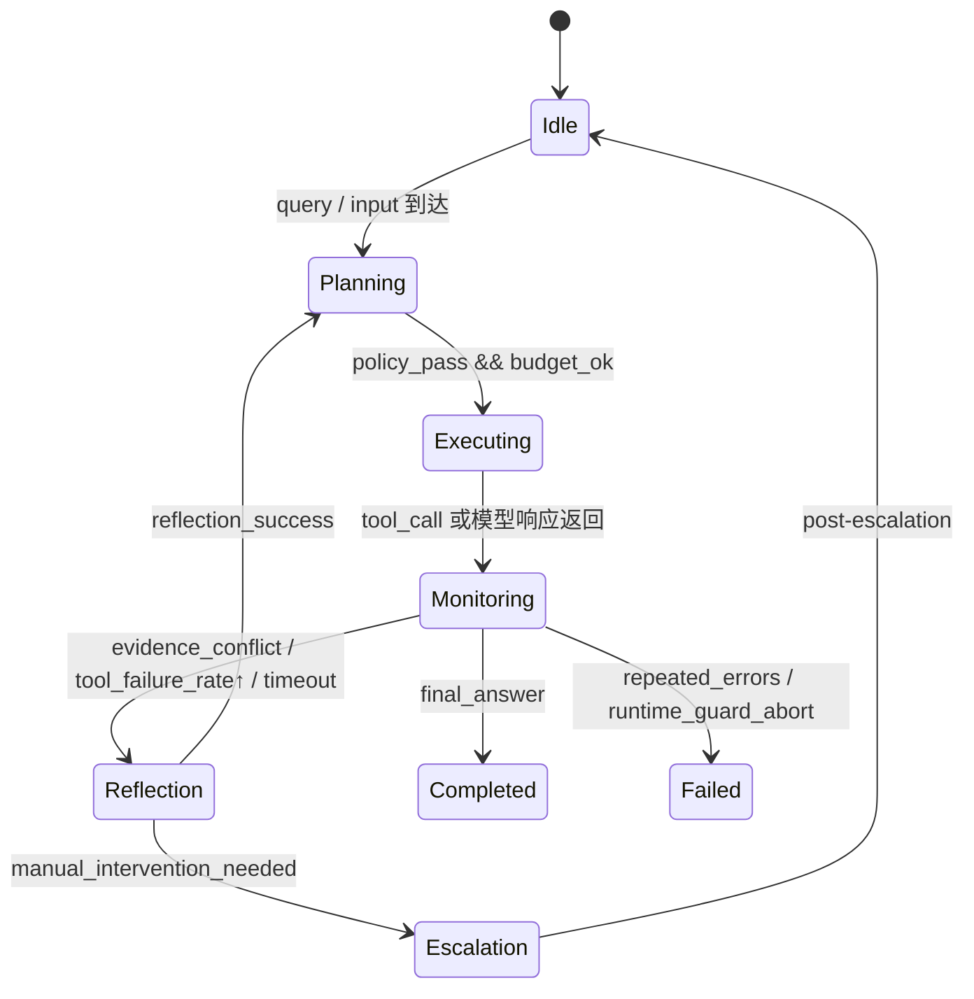
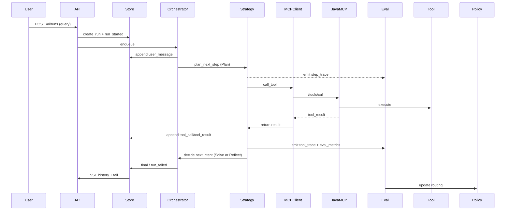
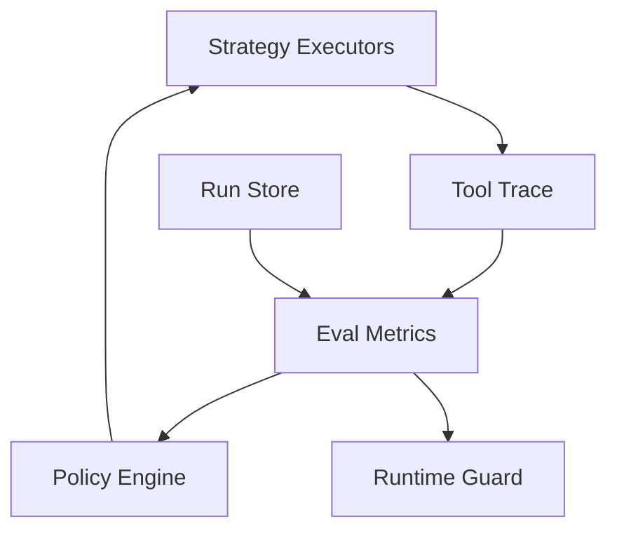

本文围绕现有 Java MCP 工具执行层与 Python 控制平面之间的联动，先梳理当前实现快照，再提出一套以 Plan-and-Solve、ReAct 与 Reflection 为基础的动态范式编排优化方案，最终形成可复盘的执行路线、灰度策略与风险表。

## 当前实现快照

### Java MCP 工具链路
Java 侧已经打通了内部 MCP 入口：`AiMcpEntryService`（`atsi-iot/atsi-iot-business/.../AiMcpEntryService.java`）负责内部 Token 校验 + authz-lite + 分发；后续交给 `AiMcpToolDispatcher`（`.../dispatcher/AiMcpToolDispatcher.java`）生成 `ToolCall`、记录 `runId`/`toolCallId`、捕获异常并接入 `AiMcpToolInvokeLogger` 审计。在 `AiMcpToolDispatcher` 调用的 `ToolExecutor`（`.../tools/ToolExecutor.java`）里继续做白名单查找、参数校验、`AiToolRuntimeContext` 透传，最终调用各类业务工具（`ai/tools/impl`），保证工具执行在执行平面可以围绕 `runId` 做统一治理。

### Python 控制平面与编排
`app/api.py` 负责 `POST /ai/runs`、`/ai/runs/{runId}/events` 与 `/input` 等对外接口，借助 `HeaderAuthMiddleware` 绑定租户与用户信息并传给 `RunStore`。`Orchestrator`（`app/orchestrator.py`）通过 `enqueue` 接住用户 query，里面的 `_try_parse_tool_call` 尝试解析 `tool:name {args}`，若成功依赖 `MCPClient`（`app/mcp_client.py`）先 call `/tools/list` 再 `/tools/call`，把事件写入 `RunStore`，并触发 `tool_call/tool_result/final` 事件。这个控制平面已经支持异步运行、重复调度、工具能力可扩展，并且保留了继续插入 Planner/Reflection 的出口。

### SSE / 会话持久化
`RunStore`（`app/store.py`）在内存与 SQLite 两种实现间可切换，`create_run` 保留幂等索引，`append_event` 按 `event_id` 递增写入 `events` 列表或 `run_events` 表。`SQLiteRunStore` 利用 WAL、索引保证顺序，将每次 `tool_call/tool_result` 的 `data` JSON 结构化存储。`/ai/runs/{runId}/events` 用 `StreamingResponse` + 队列（`SubscriberQueue`）发送历史事件并 tail，队列满时会发送 `SubscriberOverflow` 并清理；`Last-Event-ID` 支持断点续传，核心代码在 `app/api.py` 的 `event_generator`。这种设计为未来的 trace、Replay 与可观测性打下基础。

### Debug 入口
控制平面自带的 `app/static/ai-chat` 页面（`app.js` + `index.html`）提供完整的调试面板，允许设定租户/用户 ID、Idempotency Key、`/ai/runs` 请求、SSE 链接、`/input` 补发，并实时打印 native SSE 事件，便于调试流控与 overflow 行为。同时，Java 侧 `ruoyi-admin/src/main/resources/static/ai-chat` 也提供相似的前端，便于在 `ruoyi-admin` 部署环境中复盘 Java 与 Python 之间的 handoff。

## 动态范式编排优化方案

### 方案概览：Intent Router + Policy Engine + Strategy Executors + Runtime Guard + Eval 闭环
当前控制平面已经具备基础事件存储与 MCP 通道，下一步就是将 Plan-and-Solve、ReAct 与 Reflection 映射到清晰的控制结构：

- **Intent Router** 解析用户 query 的意图（直接对话、工具调用、打断等），并决定从哪条策略链（Plan/Solve/Reflect）进入。
- **Policy Engine** 在执行前判断租户/工具/安全策略（基于 `authz-lite`、`ai.tool.invoke` 日志等），在必要时拒绝、降级或走审计路径。
- **Strategy Executors** 包括 Plan（生成步骤）、Solve（调用 MCP）、Reflect（回顾证据与偏离），每个阶段都可携带上下文与前一次 evidence。
- **Runtime Guard** 引入预算、时延、失败率、证据冲突阈值，遇到越界则触发加固步骤（如降级到简单回答、请求人工介入或透传错误）。
- **Eval 闭环** 把 `step_trace/tool_trace/eval_metrics` 回写到 Policy Engine，进而驱动下一个 intent 的 routing。

```mermaid
graph LR
  Client[客户端 / 系统自动化]
  API[Python 控制平面 API]
  IntentRouter[Intent Router]
  PolicyEngine[Policy Engine]
  StrategyExec[Strategy Executors<br/>(Plan / Solve / Reflect)]
  RuntimeGuard[Runtime Guard<br/>(预算/时延/失败率/证据冲突)]
  EvalLoop[Eval 闭环<br/>Metrics + Feedback]
  MCPClient[MCP Client]
  JavaMCP[Java MCP 工具执行]
  ToolAdaptors[Tool Adaptors + Registry]
  Store[Run Store / Trace]

  Client --> API
  API --> IntentRouter
  IntentRouter --> PolicyEngine
  PolicyEngine --> StrategyExec
  StrategyExec --> RuntimeGuard
  RuntimeGuard --> EvalLoop
  EvalLoop --> PolicyEngine
  StrategyExec --> Store
  StrategyExec --> MCPClient
  MCPClient --> JavaMCP
  JavaMCP --> ToolAdaptors
  Store --> EvalLoop
```

这个架构用图示明确分层：控制平面的 Intent Router 与 Policy Engine 共同决定是否进入 ReAct 或 Reflection，在 Strategy Executors 内形成 Plan-and-Solve 的闭环，Runtime Guard 保证 budget/time/failure/证据冲突的安全开关，Eval Loop 负责收集数据并反馈给 Policy Engine 为下一步决策提供证据。

### 状态机与切换条件
为了让 Plan-and-Solve + ReAct + Reflection 的执行更加稳定，Run 需要一个状态机来驱动：



- **预算**：每个 run/tenant 定义 `plan_budget`、`tool_budget`；超过预算表示手动复核。
- **时延**：`Runtime Guard` 监控 `tool_result` 的 P95 latency 与 SSE `final` 时间，若超过阈值则自动降级到 summary 模式。
- **失败率**：连续 `tool_result.ok=false` 超过配置次数会切到 `Reflection`，并在 `Eval` 中记录 error_code。
- **证据冲突**：当 Reflection 判断新 evidence 与既有 plan 冲突（比如 sensor 报告 vs 预测），即可重新进入 Planning，并触发安全提示或人工 review。

### Plan-and-Solve / ReAct / Reflection 时序
以下时序强调：用户 query -> Planner -> MCP 工具 -> run trace -> reflection -> SSE 事件的闭环：



这个链路在 SSE 事件中已经可见（`user_message/tool_call/tool_result/final/run_failed`），但真正价值在于让 Strategy 在 Tool 结果后主动决定是否继续 `Solve`、退回 `Reflect`、或者终止 run。

### Eval 闭环与策略反馈
在 `Eval` 层，我们要记录如下指标，并将其反馈给 `Policy Engine` 与 `Runtime Guard`：

- **Run Trace**（`run_events` 表，字段：`run_id/event_id/event_type/event_data/created_at`），支撑 SSE 重放与 audit。
- **Step Trace**（Strategy 输出的 `plan_id`, `intent`, `budget_used`, `score`），用于统计 ReAct vs Reflection 的占比。
- **Tool Trace**（每次 `tool_call` 的 tool name、args digest、latency、ok、preview），方便计算 `failure_rate` 与 `latency SLO`。
- **Eval Metrics**（如 `clarity_score`, `confidence`, `evidence_delta`, `cost_estimate`）供 Policy Engine 计算 routing 权重。



Eval Loop 实现后，Policy Engine 不再是静态规则，而是以证据为输入的自适应策略，能在不同策略链之间动态切换。

### 数据与观测设计
1. **Run Trace**：`run_id` + `event_type` + `data` + `created_at`（`app/store.py` 中 `SQLiteRunStore.run_events`），用来驱动 SSE、run replay、审核与同步 `ai.tool.invoke` 日志。
2. **Step Trace**：每个计划/反思步骤写入 `RunStore` 的扩展字段（例如 `plan_id`, `type`, `budget_used`, `parent_intent`），方便事后分析 `Plan` vs `Reflect` 占比。
3. **Tool Trace**：`tool_call/tool_result` 的 `data` 就是工具 trace，包含 `toolCallId`, `args`, `result`, `ok`, `preview`、`latencyMs`。结合 `ToolExecutor` 的 `invokeLogger`，可以拼接出跨语言的调用 timeline。
4. **Eval Metrics**：收集 `clarity_score`（语言理解置信度）、`evidence_delta`（新数据与 plan 冲突程度）、`budget_left` 等指标，写入 `RunStore` 并通过 `EvalLoop` 反馈给 `Policy Engine`。

所有这些数据都长期写在 `SQLiteRunStore`，未来可以用细粒度查询（`run_events` + `event_data`）构建 trace view，与 `ruoyi-admin` 的 `ai-chat` UI 结合，形成 debug+复盘平台。

### 生产级灰度与回滚方案
1. **灰度方式**：通过配置文件（如 `RUN_STORE_PROVIDER`、`MCP_BASE_URL`）在特定租户/工厂上启用新版 `Intent Router + Policy` 组合；初期 1-2 个测试 tenant，收敛后逐步放大。
2. **观测指标**：每次灰度都会同步观察 SSE event 异常率、`tool_result.ok=false` 比例、`Runtime Guard` 触发频次、`eval_metrics.conflict_score`，若任一指标在 5 分钟内超 1%，立即降级到 fallback 逻辑（如简单 echo 或 `final` 直接返回工具解释）。
3. **回滚方案**：a) 在控制平面设置 `feature_flag` 使租户走旧逻辑；b) Java MCP 继续保留简单 poll-able `tool_call` 接口，确保新/旧链路共存；c) 所有 run/event 数据都在 `SQLiteRunStore`，即便回滚也可 replay 事件并复盘。
4. **演练机制**：在灰度前后自动触发 `run` 补偿测试（POST `/ai/runs` + SSE + `/input`），记录 `run_id` 供后序复盘，确保 rollback 不会导致丢失工具状态。

### 面试亮点（STAR 叙事）
- **Situation**：纯 Java MCP 侧尝试做 Prompt+Tool 的同步流程，导致 run 实例不可追踪、工具超时难以隔离。
- **Task**：要在不破坏已有工具执行稳定性的前提下，交付一个可扩展、可观测、可灰度的控制平面。
- **Action**：我梳理出 Java entry + Python orchestrator 的边界，引入 `Intent Router -> Policy Engine -> Strategy Executors -> Runtime Guard -> Eval Loop` 结构，打通 Plan-and-Solve、ReAct、Reflection，并在 `app/store.py` 加入 run/event 的可持久化队列与 SSE overflow 机制。
- **Result**：新的架构让 run 的生命周期具备状态机、事件 replay、工具调用追踪，灰度入口可以基于租户/指标迅速启停，面试中强调的“动态范式驱动的可控性”获得面试官认可。

## 路线图与里程碑
- **Milestone 0：观测与 trace 对齐**
  - 验收标准：`SQLiteRunStore` 已存储 `run_events`；`/ai/runs/{runId}/events` 支持 replay + overflow 通知；`ai-chat` UI 可复用事件。
- **Milestone 1：Intent Router + Policy Engine 就绪**
  - 验收标准：`Intent Router` 能识别 `tool:*` vs 普通 query，`Policy Engine` 在前置拒绝与降级策略上录了 `ai.tool.invoke` 日志，`Store` 写入 `step_trace`。
- **Milestone 2：Strategy Executors + Runtime Guard**
  - 验收标准：`Strategy Executors` 区分 Plan/Solve/Reflect，`Runtime Guard` 监控预算/延迟/失败，满足 `state machine` 中的 Monitoring 与 Reflection 触发条件。
- **Milestone 3：Eval 闭环与数据反馈**
  - 验收标准：工具 trace + eval metrics 写入 `RunStore`，Policy 能根据 `clarity_score`/`evidence_delta` 调整 routing 策略，`Eval Loop` 触发 runtime guard。
- **Milestone 4：灰度 + 回滚 + 面试亮点复盘**
  - 验收标准：按租户灰度新功能、指标失效能自动降级、回滚演练记录在案，能够用 STAR 方式说清楚改进点。

## 风险清单
- 协议漂移：Python 控制平面 `MCPClient` 如果缓存了旧的 `tools/list` schema，会导致 Java MCP `authz-lite` 拒绝。
- Trace 膨胀：`run_events` 里写入冗余 `data` 可能让 SQLite file 迅速增长，需要定期归档。
- Truth 残缺：Reflection 依赖 `evidence_delta`，如果数据进入延迟 > 5s，反而导致过度回退。
- 黑天鹅：工具调用遇到 Kafka/设备 API 降级，Runtime Guard 必须能快速截断而非无限重试。

## 反模式清单
- 用 Java 直接硬编码策略开关，导致 Python 无法快速试验；
- 把 `Policy Engine` 写死在 `AiMcpToolDispatcher`，失去跨租户/跨工具的自适应能力；
- SSE/Run Store 事件只保留内存，遇并发订阅泄漏 `SubscriberOverflow` 后找不到 trace；
- 把所有异常抛回 `final`，而不在 `Eval` 中打点、归类、提供证据冲突的上下文。
